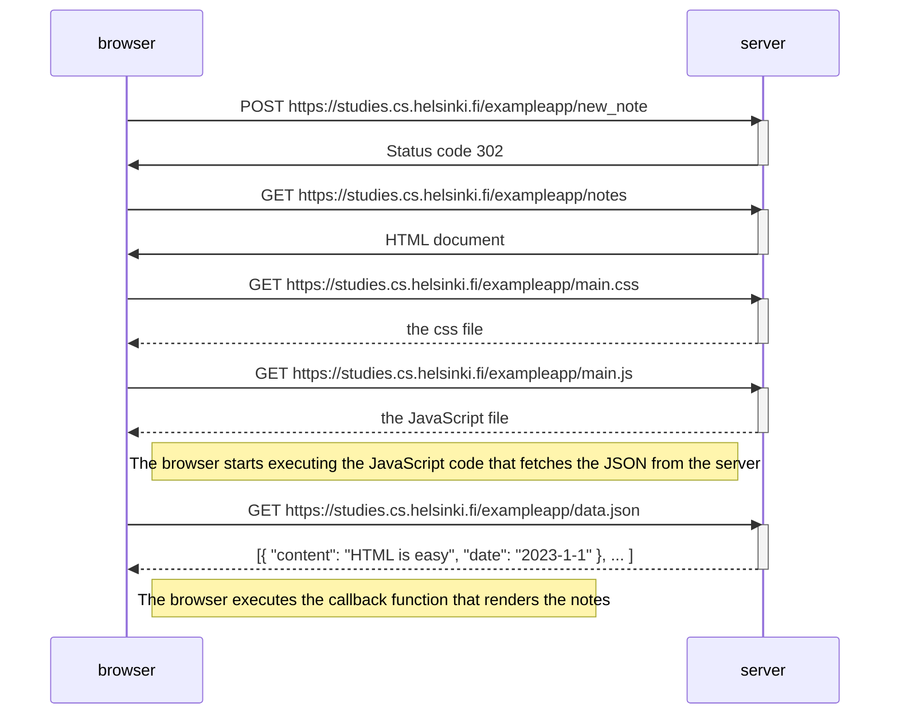

1.An HTTP POST request is made to the server address new_note . (form is sent as an HTTP POST)

2.The server responds to the request with HTTP status code 302. This is a so-called redirection request , i.e. redirection, with which the server prompts the browser to automatically make a new HTTP GET request to the location referred to in the Location header , i.e. the address notes .

3.So the browser reloads the notes page. The page load also triggers three other HTTP requests: loading the style file ( main.css ), the JavaScript code ( main.js ), and the raw data for the notes ( data.json ).